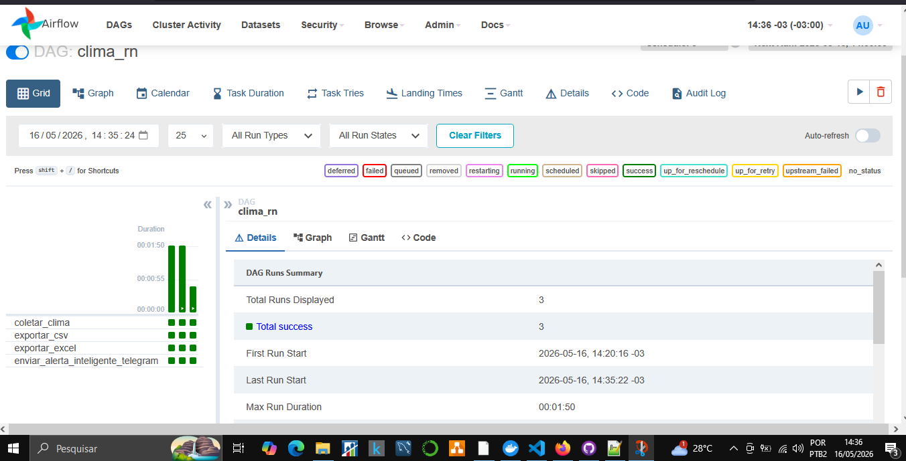
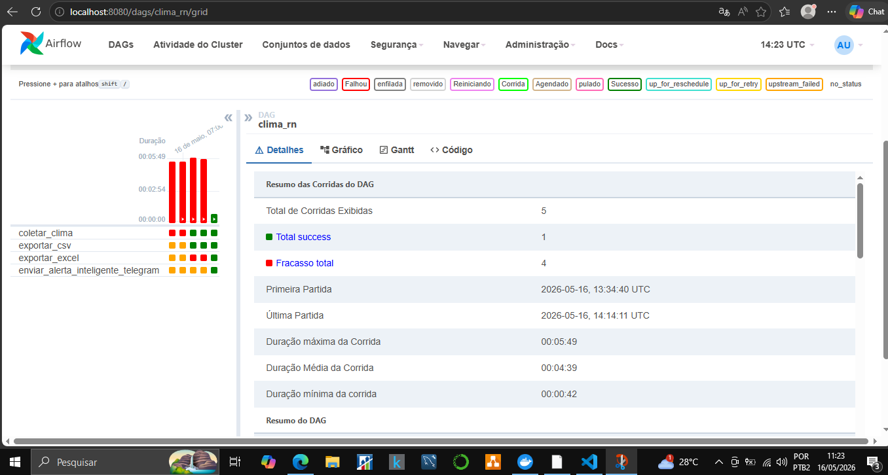
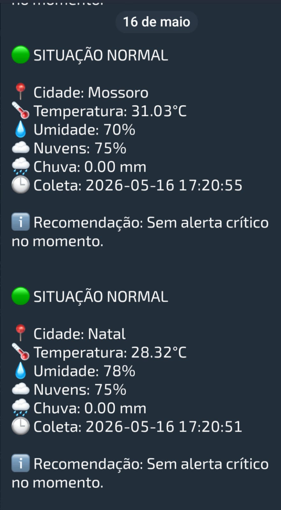
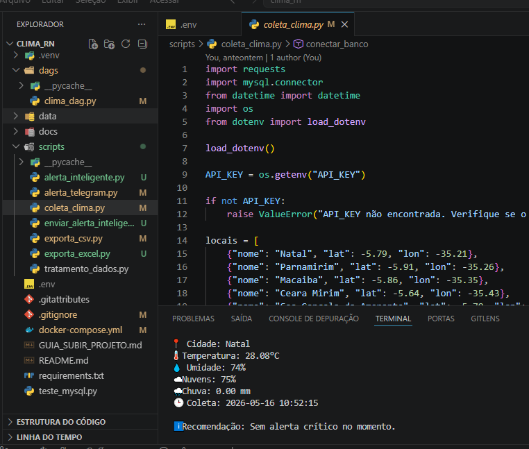
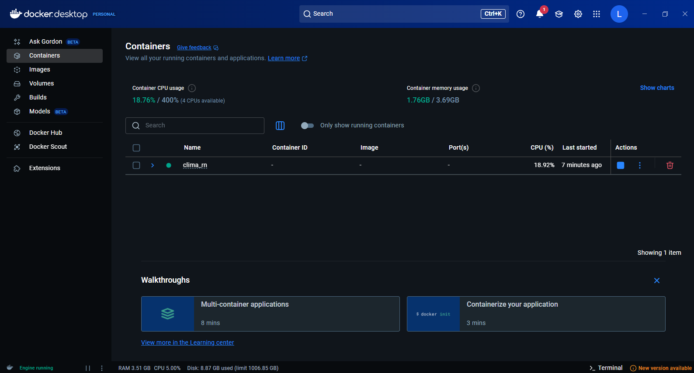

# 🌦️ Clima RN – Sistema Inteligente de Monitoramento Climático

Sistema completo de Engenharia de Dados para coleta, processamento e armazenamento de dados climáticos com geração futura de alertas automatizados.

---

## 🚀 Visão Geral

O **Clima RN** é um pipeline de dados que coleta informações meteorológicas em tempo real utilizando API externa, processa os dados e armazena em banco relacional, permitindo análises e geração de alertas.

---
## 📚 Documentação

- 📘 [Dicionário de Dados](docs/DICIONARIO_DADOS.md)

- ⭐ [Modelo Estrela (Data Warehouse)](docs/MODELO_ESTRELA.md)

- 🚨 [Data Mart de Alertas Climáticos](docs/DATA_MART_ALERTAS.md)

---

## 🧠 Arquitetura do Sistema


### 🔎 Descrição da Arquitetura

O fluxo do sistema segue o padrão moderno de engenharia de dados:

1. **Fonte de Dados**

   * API OpenWeather fornece dados climáticos em tempo real

2. **Camada de Ingestão (Extract)**

   * Script Python realiza requisições HTTP
   * Coleta dados por latitude/longitude

3. **Camada de Processamento (Transform)**

   * Tratamento e padronização dos dados
   * Extração de métricas relevantes:

     * Temperatura
     * Umidade
     * Nuvens
     * Volume de chuva

4. **Camada de Persistência (Load)**

   * Armazenamento em banco MySQL

5. **Orquestração**

 * Apache Airflow executa o pipeline automaticamente de hora em hora

6. **Infraestrutura**

   * Docker gerencia os containers (Airflow + MySQL)

---
## ✅ Pipeline em Execução

### Apache Airflow – DAG executando com sucesso

<p align="center">
  
</p>

### Corrigindo erros - DAG Quebrando 

<p align="center">
  
</p>


## 📲 Alertas Inteligentes no Telegram

<p align="center">
  
</p>

### Demonstração de Códigos

<p align="center">
  
</p>


## 🐳 Containers Docker em Execução

<p align="center">
  
</p>


## 🔄 Pipeline ETL Detalhado

### 📥 Extração

* Consumo da API OpenWeather
* Uso de coordenadas geográficas
* Requisições HTTP com `requests`

---

### 🔄 Transformação

* Conversão de tipos
* Tratamento de dados ausentes
* Normalização de campos
* Regras de negócio:

  * Se muitas nuvens → possível chuva
  * Se chuva > 0 → alerta

---

### 📤 Carregamento

Inserção no banco:

```sql
clima_dados
```

Campos armazenados:

* cidade
* latitude
* longitude
* temperatura
* descricao
* umidade
* nuvens
* probabilidade_chuva
* data_coleta

### 📤 Saídas do Pipeline

O sistema atualmente gera:

* Banco MySQL atualizado
* Arquivos CSV
* Arquivos Excel
* Alertas automáticos via Telegram
---

## ⚙️ Stack Tecnológica

| Camada       | Tecnologia     |
| ------------ | -------------- |
| Linguagem    | Python         |
| Orquestração | Apache Airflow |
| Banco        | MySQL          |
| Container    | Docker         |
| API          | OpenWeather    |
| Exportação   | CSV / Excel    |
| Alertas      | Telegram Bot API |
---


## 📂 Estrutura do Projeto

```bash
clima_rn/
│
├── dags/
│   └── clima_dag.py
│
├── scripts/
│   ├── coleta_clima.py
│   ├── exporta_csv.py
│   ├── exporta_excel.py
│   ├── alerta_inteligente.py
│   ├── alerta_telegram.py
│   └── enviar_alerta_inteligente.py
│
├── data/
│
├── docs/
│
├── docker-compose.yml
├── Dockerfile
├── requirements.txt
├── .env.example
├── README.md
└── .gitignore
```

---

## 🔐 Segurança

Uso de variáveis de ambiente:

```env
API_KEY=******
DB_HOST=clima_mysql
DB_PORT=3306

DB_HOST_LOCAL=localhost
DB_PORT_LOCAL=3307

DB_USER=admin
DB_PASSWORD=******
DB_NAME=clima
```

✔ Proteção com `.gitignore`
✔ Nenhuma credencial exposta

---

## ▶️ Execução do Projeto

### 1. Clonar

```bash
git clone https://github.com/seu-usuario/clima-rn.git
cd clima-rn
```

---

### 2. Instalar dependências

```bash
pip install -r requirements.txt
```

---

### 3. Subir ambiente

```bash
docker compose up -d
```

---

### 4. Executar pipeline manual

```bash
python scripts/coleta_clima.py
```

---

### 5. Airflow

Acesse:

```
http://localhost:8080
```


---

## 📊 Possíveis Expansões

* 📈 Dashboard com Power BI ou Streamlit
* 🤖 Machine Learning para previsão climática
* 🌎 Escalar para nível nacional
* 📲 Cadastro multiusuário para alertas Telegram
* ☁️ Deploy em nuvem (AWS/GCP/Azure/OCI)

---

## 👨‍💻 Autor

**Lúcio Fábio Barbosa de Lima**
📧 [engenheirodedados.luciofabio@gmail.com](mailto:engenheirodedados.luciofabio@gmail.com)

---

## 🔗 LinkedIn
 
https://www.linkedin.com/in/lucio-fabio-barbosa-de-lima

---

## ⭐ Diferenciais do Projeto

✔ Alertas inteligentes via Telegram
✔ Pipeline reproduzível via Docker
✔ Exportação CSV e Excel
✔ Execução automática de hora em hora

---

## 📌 Status

🚧 Em evolução – projeto ativo para portfólio de Engenharia de Dados

## 📘 Guia para iniciantes

Veja o passo a passo completo de como subir o projeto:

👉 [Guia de como subir o projeto](./docs/GUIA_SUBIR_PROJETO.md)
